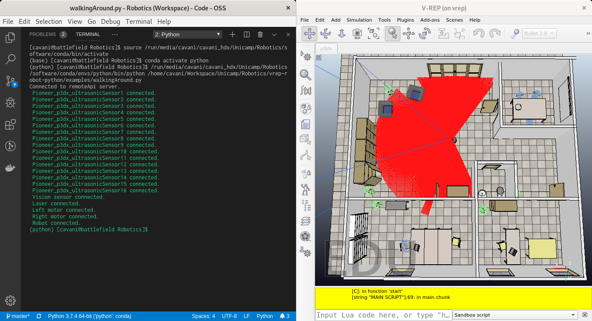
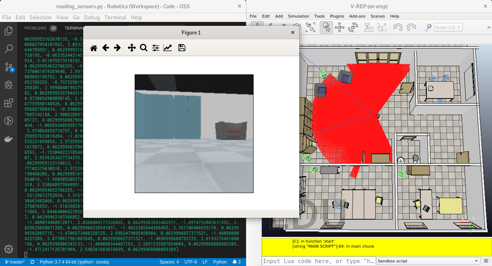
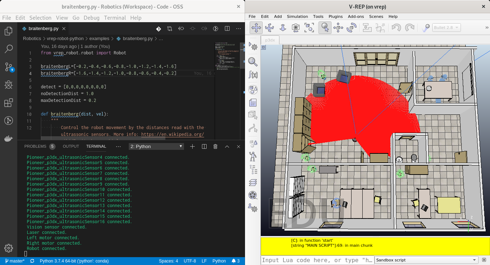

# Robotics in Python

This project contains the basic structure to control a Pioneer P3DX robot on the V-REP simulator and read its sensors.


## Setup

How to install:

```sh
pip install -e .
```

## Usage

[**V-REP P3DX Python**](../workspace/V-REP%20P3DX/V-REP%20P3DX%20Python.ipynb) ([NBViewer](https://nbviewer.jupyter.org/github/cirocavani/MO651-Robotics/blob/master/workspace/V-REP%20P3DX/V-REP%20P3DX%20Python.ipynb))

Example of a differential robot P3DX running on a V-REP simulation.


## Examples

### Walking Around

Simple commands to move the robot.

[walking_around.py](examples/walking_around.py)




### Reading Sensors

Simple commands to read data from sensors in the robot (ultrasound, laser and camera).

[reading_sensors.py](examples/reading_sensors.py)




### Braitenberg

Control the robot movement by the distances read with the ultrasonic sensors.

[braitenberg.py](examples/braitenberg.py)




# V-REP Remote API

This project contains the Python bindings for C library of V-REP Remote API.


### Development

How to use:

```python
from robotics import vrep

dir(vrep)
```

### Reference

Original files of this package belong to V-REP install:

* `<VREP_INSTDIR>/programming/remoteApiBindings/license.txt`
* `<VREP_INSTDIR>/programming/remoteApiBindings/python/python/{vrep.py,vrepConst.py}`
* `<VREP_INSTDIR>/programming/remoteApiBindings/lib/lib/Linux/64Bit/remoteApi.so`

Documentation:

http://www.coppeliarobotics.com/helpFiles/en/apisOverview.htm


http://www.coppeliarobotics.com/helpFiles/en/remoteApiOverview.htm

http://www.coppeliarobotics.com/helpFiles/en/legacyRemoteApiOverview.htm

http://www.coppeliarobotics.com/helpFiles/en/remoteApiFunctionsPython.htm
