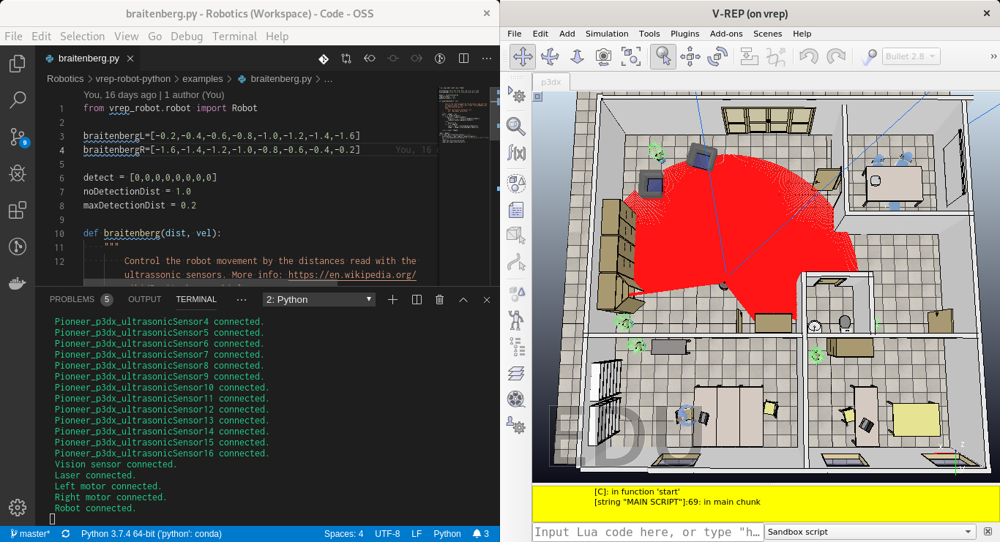

# V-REP Robot Model

This project contains the basic structure to control a Pioneer P3DX robot on the V-REP simulator and read its sensors.

## Running

You can load the scene p3dx.ttt in V-REP.

This scene contains a [Pioneer P3Dx](https://www.generationrobots.com/media/Pioneer3DX-P3DX-RevA.pdf) robot, with a Hokuyo Laser sensor and a vision sensor attached to it.

Always remember to Start the simulation **before** running your code.

## Examples

### Walking Around

Simple commands to move the robot.

[walkingAround.py](examples/walkingAround.py)

### Reading Sensors

Simple commands to read data from sensors in the robot (ultrasound, laser and camera).

[reading_sensors.py](examples/reading_sensors.py)

### Braitenberg

Control the robot movement by the distances read with the ultrasonic sensors.

[braitenberg.py](examples/braitenberg.py)

